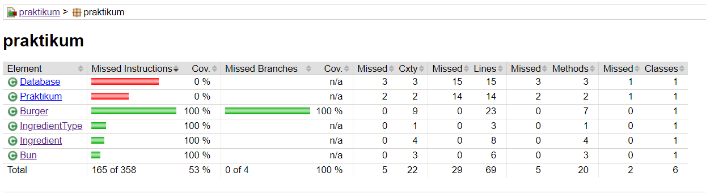

# Диплом_1
Дипломный проект - Задание №1

# Описание
Дипломный проект №1 с Unit тестами для классов Bun.java, Burger.java, Ingredient.java, IngredientType.java
Используемые технологии: Java 11, JUnit 4, maven 3.8.1, jacoco-maven-plugin 0.8.7, mockito 5.2.0
Склонирован репозиторий из https://github.com/yandex-praktikum/QA-java-diplom-1 с классами для тестового покрытия.

# Проверка покрытия
Настроен pom.xml в папке target.  
Нажать дважды ctrl и запустить команду - mvn clean verify.
После запуска классы будут проверены на покрытие и сформируется отчет по покрытию в папке проекта \target\site
Открыть в проводнике Проект/target/site и выбрать Файл - index.html. Откроется браузер с отчетом по покрытию.

